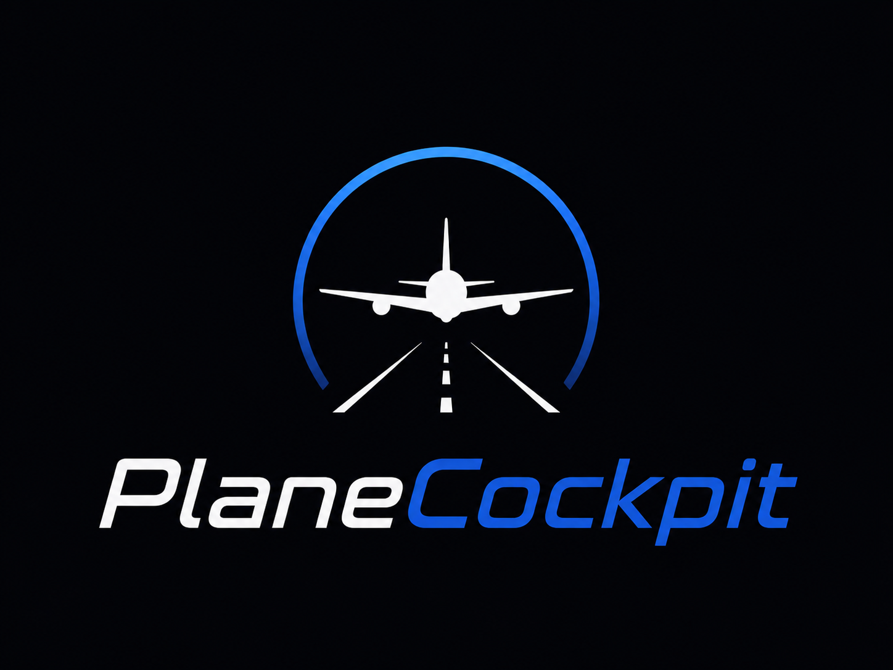

# Plane Cockpit — CLI + TUI for Plane (Cloud and self-hosted)

<p align="center">
  
</p>

Plane Cockpit is a terminal client for [Plane](https://plane.so), inspired by `gh` and `gh dash`,
distributed as a `plc` binary.
It provides a fast CLI for daily operations on projects, issues (work items), and dashboards,
plus a TUI (`plc dash`) for visual exploration. It supports both Plane Cloud and Plane
self-hosted deployments behind reverse proxies, custom TLS, and custom headers.

## Install

The published package exposes a `plc` binary:

```bash
npm install -g plc-cli
# or
npx plc-cli --help
```

End users do not need `mise`; the published artifact is a plain Node binary.

## Quick start

1. Drop a config file at `~/.config/plane-cli/config.yaml`.
   See [`examples/config.yaml`](examples/config.yaml). This file is safe to commit.

2. Authenticate:

   ```bash
   plc auth login
   ```

   The API key is prompted (masked) and stored at `~/.config/plane-cli/hosts.yaml`
   with `0600` permissions — separate from `config.yaml` so the latter can live in
   version control.

   For a config file that carries the key directly, set `auth.api_key` under the
   profile instead.

3. Run:

   ```bash
   plc auth status
   plc project list
   plc issue list --view "Current sprint"
   plc dash
   ```

## Commands

| Command                                | What it does                                           |
| -------------------------------------- | ------------------------------------------------------ |
| `plc auth login` / `logout` / `status` | manage the stored API key for the active profile       |
| `plc project list` / `view <id>`       | list projects, or show one by identifier               |
| `plc issue list`                       | list issues, optionally via a configured `--view`      |
| `plc issue view <key>`                 | show a single issue (e.g. `ENG-123`)                   |
| `plc issue open <key>`                 | open the issue in the default browser                  |
| `plc issue create`                     | create an issue (interactive, or headless via flags)   |
| `plc issue edit <key>`                 | edit title, description, or priority                   |
| `plc issue assign <key> <user>`        | assign an issue (use `me` for yourself)                |
| `plc issue transition <key> <state>`   | move an issue to a state (by name or id)               |
| `plc issue label <key> [labels...]`    | set an issue's labels (no labels clears them)          |
| `plc issue comment <key>`              | add a comment (inline, from a file, or interactive)    |
| `plc issue delete <key>`               | delete an issue (confirms unless `--yes`)              |
| `plc config show` / `validate`         | print the resolved config (keys masked) or validate it |
| `plc profile list` / `use <name>`      | list profiles, or switch the active one                |
| `plc cache status` / `warm` / `clear`  | inspect, prime, or clear the cache                     |
| `plc log path` / `tail` / `clear`      | locate, read, or remove the TUI log                    |
| `plc dash`                             | open the interactive TUI dashboard                     |

Run `plc <command> --help` for the full flag list of any command.

## Configuration

Plane Cockpit keeps two files apart, modeled after `gh`:

| File          | Purpose                                      | Safe to commit? |
| ------------- | -------------------------------------------- | --------------- |
| `config.yaml` | profiles, server URLs, views, cache settings | yes             |
| `hosts.yaml`  | API keys per host + profile (`chmod 0600`)   | **no**          |

The config file is YAML-first and validated with `zod`; invalid configs fail at
startup with the offending path.

For the complete list of options — server, auth, defaults, cache, and every view
filter and its accepted values — see [`docs/CONFIGURATION.md`](docs/CONFIGURATION.md).

`config.yaml` is read from a single location (after the `--config <path>` flag,
which overrides it):

`~/.config/plane-cli/config.yaml`

`hosts.yaml` is always read from `~/.config/plane-cli/hosts.yaml`.

All configuration lives in these two files — there are no environment variable
overrides. The active profile can be selected per invocation with `--profile`.

### API key resolution

In priority order:

1. `auth.api_key` inline in `config.yaml`.
2. Entry in `~/.config/plane-cli/hosts.yaml` (written by `plc auth login`).

`plc auth logout` removes the stored entry for the active profile.

### Profiles

A single config can declare multiple environments (e.g. `production`, `staging`).
Switch per invocation with `--profile`:

```bash
plc --profile staging issue list
```

Or persist a new active profile:

```bash
plc profile use staging
```

### Self-hosted

Plane Cockpit normalizes trailing slashes, supports custom headers, configurable timeouts, and
relaxed TLS for self-hosted clusters behind a reverse proxy:

```yaml
server:
  base_url: https://plane.internal.company.com
  workspace_slug: acme
  timeout_ms: 10000
  headers:
    X-Forwarded-Proto: https
  tls:
    reject_unauthorized: false # only for internal CAs
```

## Cache

The cache is optional and pluggable. Providers:

- `memory` — in-process, the default.
- `sqlite` — local persistent cache, file at `~/.cache/plane-cli/cache.sqlite` by default.
- `redis` — shared cache (declare `cache.redis.url`).
- `noop` — disables caching entirely.

The CLI works fully without Redis. To bypass cache for a single invocation, pass
`--no-cache`.

Common subcommands:

```bash
plc cache status
plc cache warm
plc cache clear --prefix plc:acme:project
```

## Views

Declare the universe of projects once under `defaults.projects`, then declare
views in YAML and reference them from the CLI or TUI:

```yaml
defaults:
  # The universe of projects this profile can reach. The TUI scans all of them
  # by default; the CLI (`plc issue list` without `--project`) uses the first.
  projects: ["ENG", "OPS", "DESIGN"]
  # Profile-wide default sort, inherited by any view that omits its own `sort`.
  sort: [{ priority: desc }, { updated_at: desc }]

views:
  - name: "My open" # no `projects` => scans every project above
    filters:
      assignee: me
      state_group: [unstarted, started]
    sort: priority # scalar shorthand; uses the field's natural direction

  - name: "Eng sprint"
    projects: ["ENG"] # restricts to a subset of defaults.projects
    filters:
      cycle: current # cycle/module are only allowed on single-project views
      state_group: [started]
    sort: # multi-level: each key breaks ties of the one above
      - priority: desc
      - state: asc
      - updated_at: desc
```

```bash
plc issue list --view "My open"
```

A view without `projects` inherits the full `defaults.projects` set and
aggregates issues across all of them, reordered by the view's `sort`. A view
with `projects` restricts to that subset, which must be contained in
`defaults.projects`. Because `cycle` and `module` identify a single project,
they may only be used on views that resolve to exactly one project.

`sort` accepts either a scalar (`sort: priority`, applied in the field's natural
direction) or an ordered list of single-key maps (`- priority: desc`) for
multi-level sorting, where each entry breaks ties of the ones above it. Valid
fields are `priority`, `state`, `project`, `assign`, `created_at`, and
`updated_at`. A view inherits `defaults.sort` when it omits its own.

The full list of filters (`assignee`, `state_group`, `labels`, `priority`,
`cycle`, `module`, plus client-side `state_search` / `project_state_search`) and
their accepted values is documented in
[`docs/CONFIGURATION.md`](docs/CONFIGURATION.md#filters).

## TUI usage

`plc dash` opens a multi-panel dashboard. Views auto-refresh on a configurable
interval — set `defaults.auto_refresh_seconds` (default `15`; `0` disables it,
leaving manual `r` refresh intact).

### Keybindings

Press `?` inside the TUI to open the help modal — it lists every binding grouped
by context (Global, Issue list, Views, Filter, Help) and supports incremental
search by description, action id, or key.

Default bindings:

| Key                | Action                                 |
| ------------------ | -------------------------------------- |
| `?`                | toggle help modal                      |
| `j` / `k` / arrows | navigate the issue list                |
| `g` / `G`          | jump to top / bottom                   |
| `PgUp` / `PgDn`    | scroll one page                        |
| `[` / `]`          | switch view                            |
| `Enter`            | open issue detail modal (Markdown)     |
| `Esc` (in modal)   | close current modal back to list       |
| `o`                | open the selected issue in the browser |
| `e`                | edit the selected issue                |
| `n`                | create a new issue                     |
| `r`                | refresh                                |
| `/`                | textual filter                         |
| `q`                | quit                                   |

Inside the detail modal, the same `j`/`k`/arrows/`PgUp`/`PgDn`/`g`/`G`
bindings scroll the Markdown description; `o` opens the issue in the
browser; `Esc` closes back to the list.

`e` (from the list or the detail modal) opens an edit modal for the selected
issue. `j`/`k`/arrows move focus across the editable fields (title, description,
state, assignee, priority, labels); `Enter` acts on the focused field. Title and
description open an inline text editor (`ctrl+s` applies, `Esc` cancels;
description is multiline with `Enter` for newline). State, assignee, priority and
labels open a picker — the assignee and label pickers are multi-select (`Enter`
toggles an entry, `ctrl+s` confirms the set, an empty set clears it), state and
priority confirm on `Enter`. Inside a picker, `Esc` returns to the form. `ctrl+s`
in the form saves every change in a single request; `Esc` closes, asking to
confirm first if there are unsaved changes.

`n` opens a create modal for a new issue, reusing the same form and pickers. When
the active view spans several projects it first asks which project to create in
(a single project is inferred). Fill the fields the same way as editing; a title
is required. `ctrl+s` creates the issue, `Esc` cancels.

Issue descriptions are stored as HTML on Plane and rendered inline as
Markdown by a small custom renderer (headings, lists, code, links,
blockquotes, strikethrough).

### Customizing keybindings

Drop a `~/.config/plane-cli/keybindings.yaml` file. Each entry maps an action id
to a key spec. See [`examples/keybindings.yaml`](examples/keybindings.yaml).

```yaml
list.next: down
list.prev: up
list.refresh: ctrl+r
global.help: "?"
```

The `?` modal flags overridden bindings with a green `*`.

## Logs

The TUI cannot print to stderr without corrupting the canvas, so `plc dash` writes
JSON Lines to `$XDG_STATE_HOME/plane-cli/log.jsonl` (default
`~/.local/state/plane-cli/log.jsonl`). Render errors caught by the React error boundary
go to the same file. Rotated to `log.jsonl.1` at ~1 MB.

```bash
plc log path        # print the log file path
plc log tail -n 100 # last 100 entries
plc log clear       # remove the file
plc --debug dash    # raise log level to debug for the next run
```

CLI commands (everything other than `dash`) continue to log to stderr via `pino`.

## Output formats

Every list / view command supports `--json`, `--yaml`, and `--limit`. `--debug` enables
verbose logging and full stack traces.

## Development

The dev toolchain is managed by [`mise`](https://mise.jdx.dev):

```bash
mise install        # node + pnpm versions pinned in mise.toml
make bootstrap      # install dev toolchain + project deps
make ci             # full pipeline: fmt-check + lint + typecheck + test-cov + build
```

Common targets:

| Target                   | Description                             |
| ------------------------ | --------------------------------------- |
| `make bootstrap`         | install dev toolchain and dependencies  |
| `make dev ARGS="..."`    | run the CLI from source                 |
| `make build`             | build the production bundle             |
| `make test`              | run unit tests                          |
| `make test-cov`          | run tests with coverage (95% threshold) |
| `make fmt` / `make lint` | format / lint                           |
| `make ci`                | full pipeline                           |
| `make clean`             | remove build artifacts                  |

Run `make help` for the full list.

## Troubleshooting

- **`api key not found`** — run `plc auth login` for the active profile, or set
  `auth.api_key` inline under the profile.
- **`config validation failed`** — run `plc config validate` to see the offending path
  reported by `zod`.
- **TLS errors against self-hosted** — set `server.tls.reject_unauthorized: false` only
  if you intentionally use a private CA.
- **Stale data** — re-run with `--no-cache` to bypass the cache, or `plc cache clear`.

## Contributing

See [`docs/CONTRIBUTING.md`](docs/CONTRIBUTING.md) for commit, tag, and PR guidelines.
